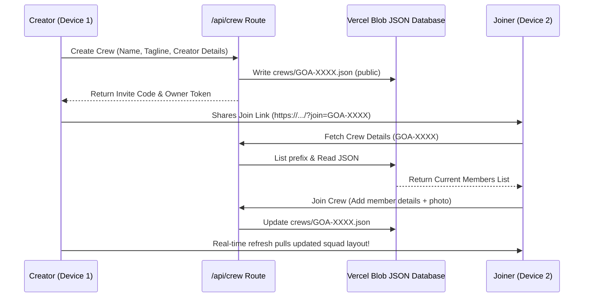

# HH Goa Builder House

Create your HH Goa builder identity, generate personalized profile frames, build your crew, and export share-ready hacker badges.

---

## 1. Project Overview

**HH Goa Builder House** is a social identity builder and collaborative crew pass generator custom-tailored for the Hacker House Goa 2026 developer community. Instead of ordinary, plain vertical ID cards, this web application serves as a design engine for developers to craft a **premium social profile identity graphic** (LinkedIn-compatible PFP overlays, event passes, and team posters) that matches the hackathon's visual DNA.

The project solves the problem of cross-device coordination and profile personalization:
1. **Identity & PFPs:** Individual builders upload, crop, zoom, and stamp their profiles with their primary developer role, stack tags, handle, and location.
2. **Squad pass collaboration:** Up to 3 builders can join a squad ("Crew"), combine their profile entries, coordinate cropping, and generate a collective crew pass, collective crew PFP, and team campaign poster.

---

## 2. ✨ Key Features

### 👤 Individual Builder Customization
- **Circular Photo Masking & Controls:** Custom interactive photo cropper allows real-time pan, zoom, and orientation adjustments to make the developer's face the dominant visual element.
- **HEIC Image Support:** Automatically translates iOS HEIC image formats into clean browser-renderable canvas elements client-side (via `heic2any`).
- **Dynamic Metadata & Badges:** Renders name, customized stack tags (maximum 3 tags), role title (e.g. `AI Engineer`, `Product Builder`), location, and social handle dynamically.
- **Local Storage Persistence:** Remembers user details and chosen visual themes across browser refreshes and tab switching.

### 👥 Crew Mode (Squad Studio)
- **1-3 Member Limitation:** Enforces strict limits of 1 to 3 builders per crew.
- **Overlapping Avatar Canvas:** Automatically arranges avatars based on size (1 centered circle, 2 overlapping side-by-side circles, or 3 circles in a triangular composition).
- **Crew Join Flow:** Generates a secure `ownerToken` and short random invite code (e.g., `GOA-X9A3`) or QR code that enables squad members to join from different devices.
- **Dynamic Title Assignment:** Utilizes a title generator to assign custom technical titles to members based on their stack and role combinations.
- **Multi-Asset Exports:** Renders collective Crew Passes, Crew PFPs, and high-resolution campaign posters.

### 🎨 3 Art Design Themes
- Fully implemented visual personalities (**Goa Sunset**, **Retro Green**, and **Hacker Stamp**) that alter borders, decorative stars, grids, barcode vectors, registration marks, stamps, and color palettes.
- **Live Preview Updates:** Live canvas updates immediately on keypress, layout change, or theme selection.

---

## 3. 🎨 Design System

The application employs a bold, high-contrast neobrutalist aesthetic matching the Goa landscape and developer subculture:

### 🌅 Goa Sunset (Theme 0)
- **Colors:** Deep emerald green background base, warm yellow accents, hot pink tags, and cream cards.
- **Visuals:** Warm sunburst elements, wave vectors at the borders, corner stars (✦), and rounded badges.

### 📼 Retro Green (Theme 1)
- **Colors:** Muted vintage cream card surface (`#faf8f0` / `#f2f0e8`) with dark border lines.
- **Visuals:** Technical blueprint grid pattern, camera/print crosshairs in corners, double photo framing, and structured layout sections.

### ⚡ Hacker Stamp (Theme 2)
- **Colors:** High-contrast neobrutalist hot pink, yellow stamps, and black fill plates.
- **Visuals:** Technical vector barcodes, registration marks, hazard stripe indicators, serial number stamps, and verification marks ("SHIP IT", "VERIFIED").

---

## 4. 👤 Individual Builder Flow

1. **Upload Profile Photo:** Click or drag-n-drop an image (JPG, PNG, or iOS HEIC).
2. **Crop & Position:** Use the interactive pointer-driven canvas to zoom and pan.
3. **Select Badge Format:** Toggle between a square **PFP Overlay** (social avatar) or a tall **Builder Pass**.
4. **Select Art Theme:** Toggle between *Goa Sunset*, *Retro Green*, or *Hacker Stamp*.
5. **Fill Builder Details:** Enter your Name, Role, Stack, optional Location, and X/Twitter handle.
6. **Generate Pass:** Click **Create My Pass** / **Create My Frame** to compile.
7. **Download & Share:** Download the high-resolution PNG or click the share link to generate a tweet.

---

## 5. 👥 Crew Mode Data Flow



---

## 6. 🖼️ Image & Data Storage

This project uses a serverless storage architecture backed entirely by **Vercel Blob Storage**, removing the need for a separate database or file server.

### Storage Layers
- **Local Browser State:** While adjusting profiles, images are processed in-memory as local object URLs (`blob:http://...`) for lag-free crop previews.
- **Cloud Persistence:**
  - **Photos:** Crop coordinate offsets and processed images are uploaded to Vercel Blob, generating immutable public URLs.
  - **Crew JSON database:** Crew lists, metadata details, variant settings, and generated passes are stored as public JSON files under `crews/{code}.json`.
  - **Re-retrieval:** When another device joins or views the pass, the server fetches the JSON payload via the Vercel Blob list API and loads the images directly from their persistent Cloud CDN endpoints.

### Environment Variables
To authenticate with Vercel Blob Storage, the following environment variable is required:
- `BLOB_READ_WRITE_TOKEN`: Private authentication token generated by Vercel.

---

## 7. 🏗️ Tech Stack

- **Framework:** [Next.js 16.3.0](https://nextjs.org/) (App Router configuration)
- **Language:** TypeScript
- **State & Logic:** React 19 (Client components, context layers, hooks)
- **Styling:** CSS & Tailwind CSS v4 (with `@tailwindcss/postcss`)
- **Graphics Rendering:** HTML5 Canvas API (custom vector overlays, barcode generation, text boundaries fitting, stamp rendering)
- **File Conversion:** `heic2any` (for iOS HEIC support)
- **Icons:** `lucide-react`
- **Cloud Storage:** `@vercel/blob`

---

## 8. 📁 Project Structure

```text
Hacker House Goa/
├── public/                 # Static branding assets & assets
└── src/
    ├── app/                # Next.js App Router
    │   ├── api/            # API Route endpoints
    │   │   ├── crew/       # Crew CRUD operations (create, join, updateTheme)
    │   │   └── upload/     # Vercel Blob file upload controller
    │   ├── share/[id]/     # Public social share preview pages
    │   ├── globals.css     # Global fonts, variables, and animations
    │   ├── icon.tsx        # Dynamic favicon generator
    │   ├── layout.tsx      # SEO headers & viewport meta
    │   └── page.tsx        # Entry dashboard portal
    ├── components/         # Interactive UI components
    │   ├── BuilderForm.tsx    # Builder Details form inputs
    │   ├── CrewWorkspace.tsx  # Squad join, invite, and assembly workspace
    │   ├── CropAdjuster.tsx   # Canvas pan-n-zoom crop tool
    │   ├── DesignSelector.tsx # Theme and badge format toggles
    │   ├── Generator.tsx      # Main application layout manager
    │   ├── PhotoUpload.tsx    # Drag-n-drop file handler (PNG, JPG, HEIC)
    │   └── ResultView.tsx     # Compilation export card
    └── lib/                # Utility modules & canvas drawing engines
        ├── canvasDraw.ts      # Core vector canvas drawing operations
        ├── crewDb.ts          # Vercel Blob JSON database wrapper
        └── titleGenerator.ts  # Automatic title generator logic
```

---

## 🚀 Running Locally

1. Install dependencies:
   ```bash
   npm install
   ```
2. Configure `.env.local` based on `.env.example`:
   ```bash
   BLOB_READ_WRITE_TOKEN=your_vercel_blob_token_here
   ```
3. Launch development server:
   ```bash
   npm run dev
   ```
4. Build for production:
   ```bash
   npm run build
   ```
